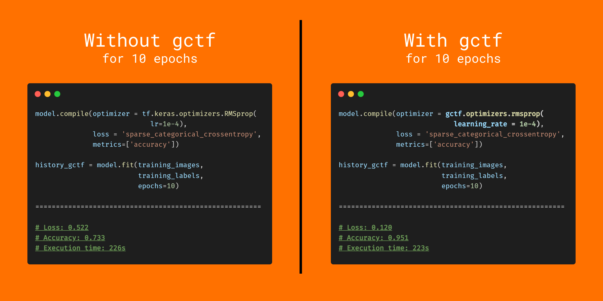

# Gradient Centralization TensorFlow [](https://twitter.com/intent/tweet?text=Wow:&url=https%3A%2F%2Fgithub.com%2FRishit-dagli%2FGradient-Centralization-TensorFlow)

[](https://pypi.org/project/gradient-centralization-tf/)
[](https://doi.org/10.5281/zenodo.4570279)
[](https://github.com/Rishit-dagli/Gradient-Centralization-TensorFlow/actions/workflows/python-publish.yml)
[](https://github.com/Rishit-dagli/Gradient-Centralization-TensorFlow/actions/workflows/flake8-lint.yml)


[](https://mybinder.org/v2/gh/Rishit-dagli/Gradient-Centralization-TensorFlow/HEAD)
[](https://colab.research.google.com/github/Rishit-dagli/Gradient-Centralization-TensorFlow)

[](LICENSE)
[](https://www.python.org/dev/peps/pep-0008/)
[](https://github.com/Rishit-dagli/Gradient-Centralization-TensorFlow/stargazers)
[](https://github.com/Rishit-dagli/Gradient-Centralization-TensorFlow/network)
[](https://github.com/Rishit-dagli/Gradient-Centralization-TensorFlow/watchers)

This Python package implements Gradient Centralization in TensorFlow, a simple and effective optimization technique for 
Deep Neural Networks as suggested by Yong et al. in the paper 
[Gradient Centralization: A New Optimization Technique for Deep Neural Networks](https://arxiv.org/abs/2004.01461). It can both speedup training 
 process and improve the final generalization performance of DNNs.
 


## Installation

Run the following to install:

```bash
pip install gradient-centralization-tf
```

## About the Examples

### [`gctf_mnist.ipynb`](examples/gctf_mnist.ipynb)
[](https://colab.research.google.com/github/Rishit-dagli/Gradient-Centralization-TensorFlow/blob/main/examples/gctf_mnist.ipynb)
[](https://mybinder.org/v2/gh/Rishit-dagli/Gradient-Centralization-TensorFlow/c4c1b0f947b0ae6de0a2964b2fcb5c37faa6c72b?filepath=examples%2Fgctf_mnist.ipynb)

This notebook shows the the process of using the [`gradient-centralization-tf`](https://github.com/Rishit-dagli/Gradient-Centralization-TensorFlow) 
Python package to train on the [Fashion MNIST](https://www.tensorflow.org/api_docs/python/tf/keras/datasets/fashion_mnist) 
dataset availaible from [`tf.keras.datasets`](https://www.tensorflow.org/api_docs/python/tf/keras/datasets). It further 
also compares using `gctf` and performance without using `gctf`.

### [`gctf_horses_v_humans.ipynb`](examples/gctf_horses_v_humans.ipynb)

[](https://colab.research.google.com/github/Rishit-dagli/Gradient-Centralization-TensorFlow/blob/main/examples/gctf_horses_v_humans.ipynb)
[](https://mybinder.org/v2/gh/Rishit-dagli/Gradient-Centralization-TensorFlow/c4c1b0f947b0ae6de0a2964b2fcb5c37faa6c72b?filepath=examples%2Fgctf_horses_v_humans.ipynb)

This notebook shows the the process of using the [`gradient-centralization-tf`](https://github.com/Rishit-dagli/Gradient-Centralization-TensorFlow) 
Python package to train on the [Horses vs Humans](http://www.laurencemoroney.com/horses-or-humans-dataset/) dataset by 
[Laurence Moroney](https://twitter.com/lmoroney). It further also compares using `gctf` and performance without using 
`gctf`.

## Usage

### [`gctf.centralized_gradients_for_optimizer`](https://github.com/Rishit-dagli/Gradient-Centralization-TensorFlow/blob/main/gctf/centralized_gradients.py#L45-L55)

Create a centralized gradients functions for a specified optimizer.

#### Arguments:
- `optimizer`: a `tf.keras.optimizers.Optimizer object`. The optimizer you are using.

#### Example:

```py
>>> opt = tf.keras.optimizers.Adam(learning_rate=0.1)
>>> opt.get_gradients = gctf.centralized_gradients_for_optimizer(opt)
>>> model.compile(optimizer = opt, ...)
```
    
### [`gctf.get_centralized_gradients`](https://github.com/Rishit-dagli/Gradient-Centralization-TensorFlow/blob/a7c5226dad86ca42341061e3fafc8c8d1ec3f51f/gctf/centralized_gradients.py#L5-L42)

Computes the centralized gradients.

This function is ideally not meant to be used directly unless you are building a custom optimizer, in which case you
could point `get_gradients` to this function. This is a modified version of
`tf.keras.optimizers.Optimizer.get_gradients`.

#### Arguments:
- `optimizer`: a `tf.keras.optimizers.Optimizer` object. The optimizer you are using.
- `loss`: Scalar tensor to minimize.
- `params`: List of variables.

#### Returns:
A gradients tensor.

### [`gctf.optimizers`](https://github.com/Rishit-dagli/Gradient-Centralization-TensorFlow/blob/main/gctf/optimizers.py)

Pre built updated optimizers implementing GC.

This module is speciially built for testing out GC and in most cases you would be using [`gctf.centralized_gradients_for_optimizer`](https://github.com/Rishit-dagli/Gradient-Centralization-TensorFlow#gctfcentralized_gradients_for_optimizer) though this module implements `gctf.centralized_gradients_for_optimizer`. You can directly use all optimizers with [`tf.keras.optimizers`](https://www.tensorflow.org/api_docs/python/tf/keras/optimizers) updated for GC.

#### Example:

```py
>>> model.compile(optimizer = gctf.optimizers.adam(learning_rate = 0.01), ...)
>>> model.compile(optimizer = gctf.optimizers.rmsprop(learning_rate = 0.01, rho = 0.91), ...)
>>> model.compile(optimizer = gctf.optimizers.sgd(), ...)
```

#### Returns:
A `tf.keras.optimizers.Optimizer` object.

## Developing `gctf`

To install `gradient-centralization-tf`, along with tools you need to develop and test, run the following in your 
virtualenv:

```bash
git clone git@github.com:Rishit-dagli/Gradient-Centralization-TensorFlow
# or clone your own fork

pip install -e .[dev]
```

## License

```
Copyright 2020 Rishit Dagli

Licensed under the Apache License, Version 2.0 (the "License");
you may not use this file except in compliance with the License.
You may obtain a copy of the License at

    http://www.apache.org/licenses/LICENSE-2.0

Unless required by applicable law or agreed to in writing, software
distributed under the License is distributed on an "AS IS" BASIS,
WITHOUT WARRANTIES OR CONDITIONS OF ANY KIND, either express or implied.
See the License for the specific language governing permissions and
limitations under the License.
```
